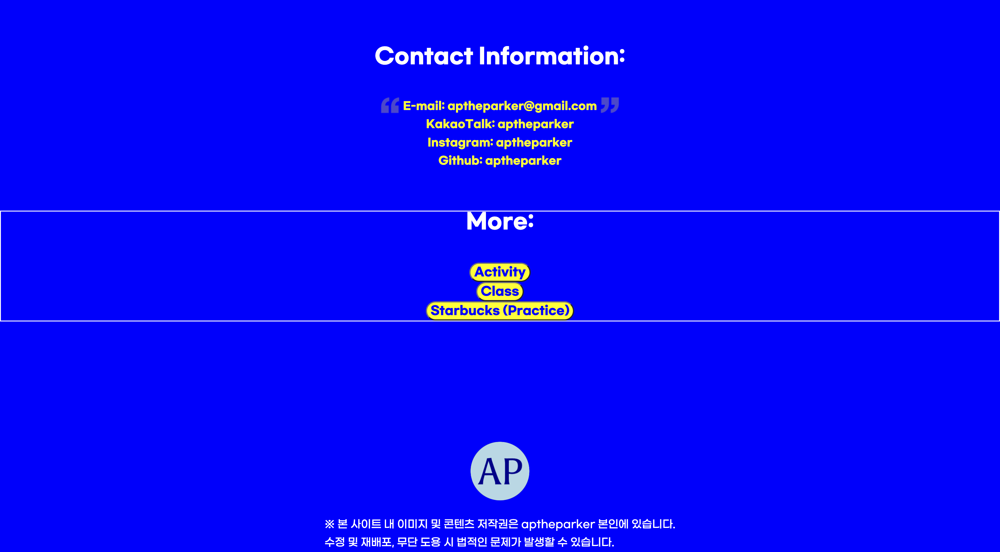

<div align="center">

  
  <h1>AP's Website</h1>
  
  <p>
    AP's Personal Website.
  </p>
  
  
<!-- Badges -->
<p>
  <a href="https://github.com/aptheparker/me/graphs/contributors">
    
  </a>
  <a href="">
    
  </a>
  <a href="https://github.com/aptheparker/me/network/members">
    
  </a>
  <a href="https://github.com/aptheparker/me/stargazers">
    
  </a>
  <a href="https://github.com/aptheparker/me/issues/">
    
  </a>
  <a href="https://github.com/aptheparker/me/blob/master/LICENSE">
    
  </a>
</p>
   
<h4>
    <a href="https://github.com/aptheparker/me/">View Demo</a>
  <span> · </span>
    <a href="https://github.com/aptheparker/me">Documentation</a>
  <span> · </span>
    <a href="https://github.com/aptheparker/me/issues/">Report Bug</a>
  <span> · </span>
    <a href="https://github.com/aptheparker/me/issues/">Request Feature</a>
  </h4>
</div>

<br />

<!-- Table of Contents -->

# :notebook_with_decorative_cover: Table of Contents

- [About the Project](#star2-about-the-project)
  - [Screenshots](#camera-screenshots)
  - [Tech Stack](#space_invader-tech-stack)
- [Getting Started](#toolbox-getting-started)
  - [Prerequisites](#bangbang-prerequisites)
  - [Installation](#gear-installation)
  - [Running Tests](#test_tube-running-tests)
  - [Run Locally](#running-run-locally)
- [Usage](#eyes-usage)
- [Contributing](#wave-contributing)
- [License](#warning-license)
- [Contact](#handshake-contact)
- [Acknowledgements](#gem-acknowledgements)

<!-- About the Project -->

## :star2: About the Project

<!-- Screenshots -->

### :camera: Screenshots

<div align="center"> 
  
</div>

<!-- TechStack -->

### :space_invader: Tech Stack

<details>
  <summary>Client</summary>
  <ul>
    <li>HTML</li>
    <li>CSS</li>
    <li><a href="https://www.javascript.com/">Javascript</a></li>
  </ul>
</details>

<details>
  <summary>Server</summary>
  <ul>
    <li>None</li>
  </ul>
</details>

<details>
<summary>Database</summary>
  <ul>
    <li>None</li>
  </ul>
</details>

<details>
<summary>DevOps</summary>
  <ul>
    <li>None</li>
  </ul>
</details>

<!-- Getting Started -->

## :toolbox: Getting Started

<!-- Prerequisites -->

### :bangbang: Prerequisites

None

<!-- Installation -->

### :gear: Installation

None

<!-- Running Tests -->

### :test_tube: Running Tests

None

<!-- Run Locally -->

### :running: Run Locally

Clone the project

```bash
  git clone https://github.com/aptheparker/me.git
```

<!-- Usage -->

## :eyes: Usage

This is a personal website showing my personal information.
In this website, serveral features are available:

<ul>
  <li>Activities</li>
  <li>Class Information</li>
  <li>Starbucks</li>
</ul>

<!-- Contributing -->

## :wave: Contributing

<a href="https://github.com/aptheparker/me/graphs/contributors">
  
</a>

Contributions are always welcome!

<ol>
  <li>Fork the Project</li>
  <li>Create your Feature Branch (git checkout -b feature/AmazingFeature)</li>
  <li>Commit your Changes (git commit -m 'Add some AmazingFeature')</li>
  <li>Push to the Branch (git push origin feature/AmazingFeature)</li>
  <li>Open a Pull Request</li>
</ol>

<!-- License -->

## :warning: License

None

<!-- Contact -->

## :handshake: Contact

Your Name - [@instagram](https://www.instagram.com/aptheparker) - aptheparker@gmail.com

Project Link: [https://github.com/aptheparker/me](https://github.com/aptheparker/me)

<!-- Acknowledgments -->

## :gem: Acknowledgements

None
